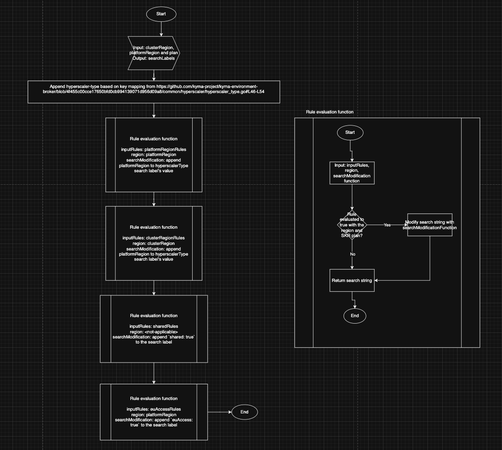

# Hyperscaler Account Pool

To provision clusters through Gardener using Runtime Provisioner, Kyma Environment Broker (KEB) requires a hyperscaler (GCP, Azure, AWS, etc.) account/subscription. Managing the available hyperscaler accounts is not in the scope of KEB. Instead, the available accounts are handled by Hyperscaler Account Pool (HAP).

HAP stores credentials for the hyperscaler accounts that have been set up in advance in Kubernetes Secrets. The credentials are stored separately for each provider and tenant. The content of the credentials Secrets may vary for different use cases. The Secrets are labeled with the **hyperscaler-type**, **euAccess**, **shared** and **tenant-name** labels to manage pools of credentials for use by the provisioning process. The **hyperscaler-type** contains hyperscaler name and region information in the format `hyperscaler_type: <HYPERSCALER_NAME>[_<PLATFORM_REGION>][_<HYPERSCALER_REGION>]`, where both `_<PLATFORM_REGION>` and `_<HYPERSCALER_REGION>` are optional. The **euAccess** and **shared** labels contain boolean values and they used to divide existing pools to secrets used by EU restricted regions and secrets shared by multiple Global Accounts. The **tenant-name** label is added when the account respective for a given Secret is claimed and it is the only one not added during Secret creation. This way, the in-use credentials and unassigned credentials available for use are tracked. The content of the Secrets is opaque to HAP.

The Secrets are stored in a Gardener seed cluster pointed to by HAP. They are available within a given Gardener project specified in the KEB and Runtime Provisioner configuration. This configuration uses a `kubeconfig` that gives KEB and Runtime Provisioner access to a specific Gardener seed cluster, which, in turn, enables access to those Secrets.

This diagram shows the HAP workflow:


Before a new cluster is provisioned, KEB queries for a Secret based on the mandatory **hyperscaler-type** and optional **tenant-name**, **euAccess** and **shared** labels.

If a Secret is found, KEB uses the credentials stored in this Secret. If a matching Secret is not found, KEB queries again for an unassigned Secret for a given hyperscaler and adds the **tenant-name** label to claim the account and use the credentials for provisioning.

One tenant can use only one account per given hyperscaler type.

This is an example of a Kubernetes Secret that stores hyperscaler credentials:

```yaml
apiVersion: v1
kind: Secret
metadata:
  name: {SECRET_NAME}
  labels:
    # tenant-name is omitted for new, not yet claimed account credentials
    tenant-name: {TENANT_NAME}
    hyperscaler-type: {HYPERSCALER_TYPE}
```

## Shared Credentials

For a certain type of SAP BTP, Kyma runtimes, KEB can use the same credentials for multiple tenants.
In such a case, the Secret with credentials must be labeled differently by adding the **shared** label set to `true`. Shared credentials will not be assigned to any tenant.
Multiple tenants can share the Secret with credentials. That is, many shoots (Shoot resources) can refer to the same Secret. This reference is represented by the SecretBinding resource.
When KEB queries for a Secret for the given hyperscaler, the least used Secret is chosen.  

This is an example of a Kubernetes Secret that stores shared credentials:

```yaml
apiVersion: v1
kind: Secret
metadata:
  name: {SECRET_NAME}
  labels:
    hyperscaler-type: {HYPERSCALER_TYPE}
    shared: "true"
```


### Shared Credentials for `sap-converged-cloud` Plan

For the `sap-converged-cloud` plan, each region is treated as a separate hyperscaler. Hence, Secrets are labeled with **openstack_{region name}**, for example, **openstack_eu-de-1**.

## EU Access

The [EU access](03-20-eu-access.md) regions need a separate credentials pool. The Secret contains the additional label **euAccess** set to `true`. This is an example of a Secret that stores EU access hyperscaler credentials:

```yaml
apiVersion: v1
kind: Secret
metadata:
  name: {SECRET_NAME}
  labels:
    # tenant-name is omitted for new, not yet claimed account credentials
    tenant-name: {TENANT_NAME}
    hyperscaler-type: {HYPERSCALER_TYPE}
    euAccess: "true"
```

## Assured Workloads

SAP BTP, Kyma runtime supports the BTP cf-sa30 GCP subaccount region. This region uses the Assured Workloads Kingdom of Saudi Arabia (KSA) control package. Kyma Control Plane manages cf-sa30 Kyma runtimes in a separate
Google Cloud hyperscaler account pool. The Secret contains the label **hyperscaler-type** set to `gcp_cf-sa30`. The following is an example of a Secret that uses the Assured Workloads KSA control package:

```yaml
apiVersion: v1
kind: Secret
metadata:
  name: {SECRET_NAME}
  labels:
    # tenant-name is omitted for new, not yet claimed account credentials
    tenant-name: {TENANT_NAME}
    hyperscaler-type: "gcp_cf-sa30"
```

## Secret Bindings Selection Rules

<!-- rules Overview -->
HAP evaluates a set of rules to determine what labels to use when querying secret bindings. Input to the rules consists of an SKR's plan, hyperscaler and region. If evaluated to true the rules modify or add labels used in the secret bindings resource query. There are four possible rules to configure:
* `hap.platformRegionRule` - if evaluated to true the `_<PLATFOR_REGION>` is appended to the `hyperscaler-type` label when searching, refered to as platform region based search,
* `hap.clusterRegionRule` - if evaluated to true the `_<HYPERSCALER_REGION>` is appended to the `hyperscaler-type` label when searching, refered to as cluster region based search,
* `hap.sharedRule` - if evaluated to true the `shared: true` label is used when searching, refered to as shared based search,
* `hap.euAccessRule` - if evaluated to true the `shared: true` label is used when searching, refered to as euAccess based search.
The configuration is done by specifying above rules in KEB helm values. 

<!-- rules format -->
Each rule consists of a semicolon separated list of plans that the rule applies to. Additionally, a plan can be extended with `:region` suffix that makes the rule evaluate to true only if a cluster is provisioned in the specified region. List entries comply with the format `<PLAN_ID_1>:<REGION_ID_1>;<PLAN_ID_2>:<REGION_ID_2>`. Either plan or region (but never both) can be specified as wildcard `*` meaning all plans or regions should apply for specific second value. The following example lists valid and invalid configuration values:
* `trial` - valid, rule will be evaluated to true for the `trial` plan in all regions,
* `trial:*` - valid, rule will be evaluated to true for the `trial` plan in all regions,
* `trial:eu` - valid, rule will be evaluated to true for the `trial` plan in the `eu` region,

* `*:eu` - valid, rule will be evaluated to true for all plans in the `eu` region,
* `eu:*` - invalid, plan must be specified in the first part of `<PLAN_ID>:<REGION_ID>` pair,
* `*:*` - invalid, at least one of the values must be specified in the `<PLAN_ID>:<REGION_ID>` pair.

* `*:eu;trial:eu` - valid, rule will be evaluated to true for all plans in the `eu` region and for the `trial` plan in the `eu` region, configuration can be duplicated
* `trial:eu;trial:gcp` - valid, rule will be evaluated to true for trials plans but only in `eu` and `gcp` regions,

<!-- search construction -->


<!-- TODO: rules validation -->
Rules validation is done during the KEB startup. If the configuration is invalid, KEB will not start and an error message will be displayed in the logs. The constraints used for validation include:
* Rules format check - all the rules must comply with the format specified above.
* Plan ?and region? existence check.