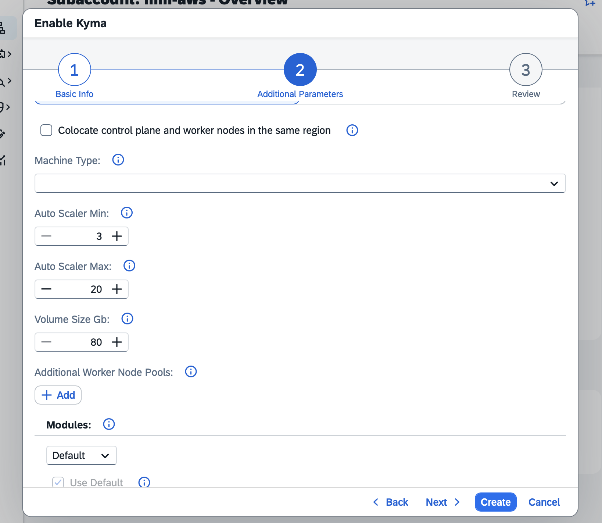
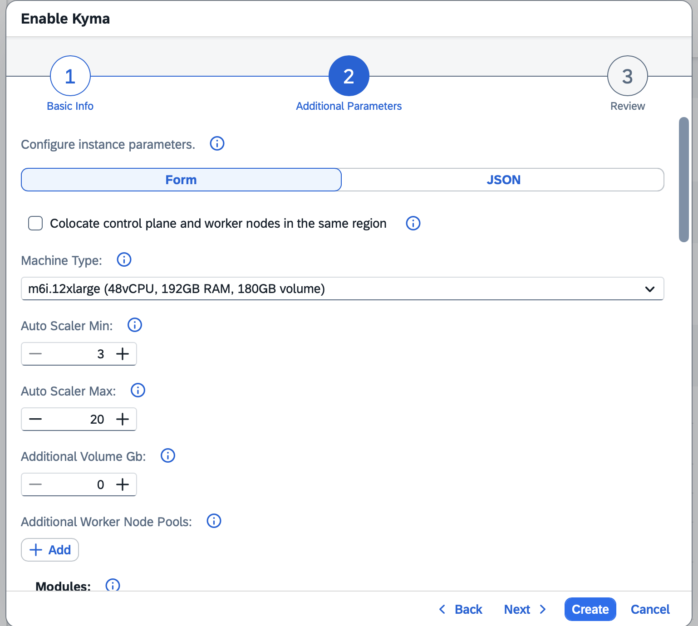

# Configurable Node Volume Size

## Contents

- [Status](#status)
- [Context](#context)
  - [Current State](#current-state)
- [Approach 1: Static `volumeSizeGb` per Worker Pool](#approach-1-static-volumesizegb-per-worker-pool)
- [Approach 2: Dynamic Volume Based on Machine Type + `additionalVolumeGb`](#approach-2-dynamic-volume-based-on-machine-type--additionalvolumegb)
- [Decision](#decision)
- [Implementation](#implementation)
  - [Sub-approach 1: New ConfigMap](#sub-approach-1-new-configmap)
    - [Option A: Static ConfigMap defined in values.yaml](#option-a-static-configmap-defined-in-valuesyaml)
    - [Option B: Chart defines an empty ConfigMap, KEB populates it at startup](#option-b-chart-defines-an-empty-configmap-keb-populates-it-at-startup)
  - [Sub-approach 2: Extend the RuntimeCR](#sub-approach-2-extend-the-runtimecr)

## Status

Proposed

## Context

If the disk (volume) attached to Kubernetes worker nodes fills up, it can render the node unusable and cause workload disruptions.

Users running large machine types with many pods can encounter disk-full conditions because the current default volume size (80 GiB) is insufficient for high-density nodes. Today, `volumeSizeGb` is an internal KEB setting per plan and users cannot configure it.

### Current State

- `volumeSizeGb` is defined per plan in the KEB plans configuration.
- The value is not exposed to users, neither for the main worker pool nor for additional worker pools.
- `sap-converged-cloud` does not set any volume configuration.

## Approach 1: Static `volumeSizeGb` per Worker Pool

There are two variants for what we could expose to the user:

**Variant A: Expose `volumeSizeGb` directly** - the user sets the total volume size. The schema shows the default and minimum (equal to the plan default). Users see and manage the full size. When the parameter is not provided in the payload, the plan default is applied for backwards compatibility.

**Variant B: Expose only `additionalVolumeGb`** - the user sets only the extra GB on top of the plan default. The input defaults to 0. The plan default base is transparent to the user and always included for free. The input directly represents what the user pays for.

The screenshots below show Variant A. For Variant B the UI looks almost the same, but the default value would be 0 and the label would be `Additional Volume Gb`.

**BTP cockpit - main worker pool:**



**BTP cockpit - additional worker node pool:**


**Provisioning request example:**
```json
{
  "parameters": {
    "name": "my-cluster",
    "machineType": "m6i.4xlarge",
    "volumeSizeGb": 150,
    "additionalWorkerNodePools": [
      {
        "name": "gpu-pool",
        "machineType": "g4dn.8xlarge",
        "volumeSizeGb": 200,
        "autoScalerMin": 1,
        "autoScalerMax": 3
      }
    ]
  }
}
```

The schema declares `minimum` and `maximum` constraints as static values. The default and minimum are shown in the BTP cockpit.

### Billing

- The plan default volume size is included in the base machine price with no additional charge.
- Any `volumeSizeGb` value above the plan default is charged.
- The volume size is available as a status attribute on the Kubernetes node API, so the actual disk size per node can be detected at runtime for billing purposes.
- The price calculator must be updated to include a `volumeSizeGb` input field showing the additional cost when the value exceeds the default.

### Pros

- Simple to implement and maintain.
- Users pay extra only for GB above the plan default.
- No calculations of the volume size per machine are needed.
- KEB operators need to refresh ERS only once when this feature is rolled out or when the default value is changed.

### Cons

- TBD

## Approach 2: Dynamic Volume Based on Machine Type + `additionalVolumeGb`

KEB computes a volume size automatically based on the selected machine type. The computed size is included in the base machine price at no extra cost. Users can additionally request extra GB on top via an optional `additionalVolumeGb` parameter, which is billed separately per GB above the computed base.

The dynamic volume size can be obtained using one of two sub-options for the calculation:

**Sub-option A: Configurable mapping table** — maps machine size ranges (e.g., by vCPU count) to fixed volume sizes. Easier to reason about but requires maintaining the table as new machine types are added.

**Sub-option B: Formula** - computes the volume size from the machine's resources:

```
volume_size = volume_base + max(vCPUs / 2, memory_GiB / 8) * volume_factor
```

Where the formula values come from:

| Value | Source |
|-------|--------|
| `volume_base` | Configurable base amount per landscape |
| `vCPUs` | Machine type metadata from the provider (e.g., 32 vCPUs for `m6i.8xlarge`) |
| `memory_GiB` | Machine type metadata from the provider (e.g., 128 GiB for `m6i.8xlarge`) |
| `volume_factor` | Normalized resource multiplier for total volume size set per landscape |

**Example producing 148 GiB** for a 32 vCPU / 128 GiB RAM machine (e.g., `m6i.8xlarge`) on a GardenLinux landscape (`volume_base=20`, `volume_factor=8`):

```
volume_size = 20 + max(32/2, 128/8) * 8
           = 20 + max(16, 16) * 8
           = 20 + 16 * 8
           = 20 + 128
           = 148 GiB
```

The computed volume size is shown alongside vCPU and memory in the machine type display name in the BTP cockpit, e.g. `m6i.8xlarge (32 vCPU, 128 GiB RAM, 148 GiB volume)`.

**BTP cockpit - main worker pool:**



**BTP cockpit - additional worker node pool:**


**Provisioning request example:**
```json
{
  "parameters": {
    "name": "my-cluster",
    "machineType": "m6i.4xlarge",
    "additionalVolumeGb": 50,
    "additionalWorkerNodePools": [
      {
        "name": "gpu-pool",
        "machineType": "g4dn.8xlarge",
        "additionalVolumeGb": 100,
        "autoScalerMin": 1,
        "autoScalerMax": 3
      }
    ]
  }
}
```

### Billing

- The computed base volume size is included in the base machine price at no extra cost.
- Only the `additionalVolumeGb` amount is charged, per GB, per node, per month.
- The volume size is available as a status attribute on the Kubernetes node API, so the actual disk size per node can be detected at runtime for billing purposes.
- The price calculator must be updated to include a `volumeSizeGb` input field showing the additional cost when the value exceeds the default.

### Pros

- Large machines automatically get a larger disk without any user action.
- Users pay extra only for GB above the machine type default.

### Cons

- More complex to implement.
- Different formula parameters may be needed per OS image (GardenLinux vs. Ubuntu Pro).
- Users may not notice that the volume size differs per machine type.
- Every formula change requires KEB operators to be notified and ERS to be refreshed.
- There is a risk of temporarily inconsistent disk sizes displayed in the BTP cockpit if KEB already uses a different size for a given machine, since ERS refresh takes time.


## Decision

Approach 2 is chosen.

## Implementation

Two sub-approaches are considered for how the computed volume size is stored and shared between KEB and KCR.

### Sub-approach 1: New ConfigMap

A dedicated ConfigMap stores machine type characteristics and the computed default disk size for each machine type. KCR reads the ConfigMap to look up the default disk size for a given machine type and uses it to calculate the billable additional size set by the user.

Two options are considered for how the ConfigMap is populated.

#### Option A: Static ConfigMap defined in values.yaml

The machine characteristics are defined in `values.yaml` in a structured, nested format. A new section `machineCharacteristics` (name to be discussed) lists every supported machine type with its properties as nested keys:

```yaml
# values.yaml
machineCharacteristics:
  m6i.4xlarge:
    cpu: 16
    ram: 64
    gpu: 0
    nodeSize: 80
  m6i.8xlarge:
    cpu: 32
    ram: 128
    gpu: 0
    nodeSize: 148
```

A Helm template iterates over this structure and renders a flat ConfigMap, using a `machineName_field` key naming convention:

```yaml
apiVersion: v1
kind: ConfigMap
metadata:
  name: keb-machine-characteristics
data:
  {{- range $machine, $props := .Values.machineCharacteristics }}
  {{ $machine }}_cpu: {{ $props.cpu | quote }}
  {{ $machine }}_ram: {{ $props.ram | quote }}
  {{ $machine }}_gpu: {{ $props.gpu | quote }}
  {{ $machine }}_nodeSize: {{ $props.nodeSize | quote }}
  {{- end }}
```

Which produces:

```yaml
data:
  m6i.4xlarge_cpu: "16"
  m6i.4xlarge_ram: "64"
  m6i.4xlarge_gpu: "0"
  m6i.4xlarge_nodeSize: "80"
  m6i.8xlarge_cpu: "32"
  m6i.8xlarge_ram: "128"
  m6i.8xlarge_gpu: "0"
  m6i.8xlarge_nodeSize: "148"
```

As an alternative to flat keys, the ConfigMap could store the entire structure as an embedded YAML string under a single key.

```yaml
data:
  machineCharacteristics: |
    m6i.4xlarge:
      cpu: 16
      ram: 64
      gpu: 0
      nodeSize: 80
    m6i.8xlarge:
      cpu: 32
      ram: 128
      gpu: 0
      nodeSize: 148
```

**Pros:**
- Content is fully declarative in the chart.
- ArgoCD manages the ConfigMap like any other chart resource.
- No runtime logic needed to populate the ConfigMap.
- Backward compatible.
- No action required for external operators. We can define those values for every machine type in our config.
- More details available for KCR.

**Cons:**
- Some machine type data is duplicated in `values.yaml`.
- `values.yaml` length will grow significantly.

#### Option B: Chart defines an empty ConfigMap, KEB populates it at startup

The Helm chart defines the ConfigMap with no data entries. When KEB starts, it reads the existing machine type definitions from `providersConfig`, applies the volume size formula for each machine type, and writes the results into the ConfigMap. The final structure of the keys in the ConfigMap is identical to Option A.

As an alternative to running the formula, KEB could extract the node size directly from the existing enum display name (e.g. `m6i.8xlarge (32 vCPU, 128 GiB RAM, 148 GiB volume)`). The volume value would be embedded in the display name. However, this would also require the operators to update the display name, as the display name does not currently contain the volume size.

**Pros:**
- Machine type data has a single source of truth: the existing `providersConfig` in KEB.
- New machine types are picked up automatically.
- More details available for KCR.

**Cons:**
- There is a gap between KEB startup and the moment the ConfigMap is fully populated.
- Should KEB watch this ConfigMap and reconcile it, or is a new job required?
- If Argo CD manages the ConfigMap and detects drift between the chart definition (empty) and the live state (populated by KEB), it may revert the ConfigMap to the empty state on the next sync. This would require annotating the ConfigMap with `argocd.argoproj.io/compare-options: IgnoreExtraneous` (see [Argo CD compare options](https://argo-cd.readthedocs.io/en/stable/user-guide/compare-options/)).
- Most complex solution to implement.


### Sub-approach 2: Extend the RuntimeCR

The existing RuntimeCR is extended with a new field that stores the `additionalVolumeGb` for the main worker pool and each additional worker pool. The field is optional. If not present, it is interpreted as 0 (no additional volume set). The field is purely informational and must not be propagated to the ShootCR, it is used by KCR solely for billing purposes.

The `additionalVolumeGb` field is placed inside the existing `volume` object. The `volume.size` field reflects the total disk size, which is the sum of the default size and `additionalVolumeGb`.

```json
"volume": {
  "size": "100Gi",
  "type": "StandardSSD_LRS",
  "additionalVolumeGb": 20
}
```

In this example, the default size is 80 GiB and the user requested 20 GiB of additional volume, so `volume.size` is set to 100 GiB. KEB is responsible for computing this sum.

**Pros:**
- Uses the already existing RuntimeCR.
- Easier to implement and maintain. From the perspective of external KCP operators, nothing changes as no new resources are introduced.
- KCR already watches the RuntimeCR.

**Cons:**
- The RuntimeCR CRD must be extended.
- 3 teams involved in implementation.
- Less information available for KCR.