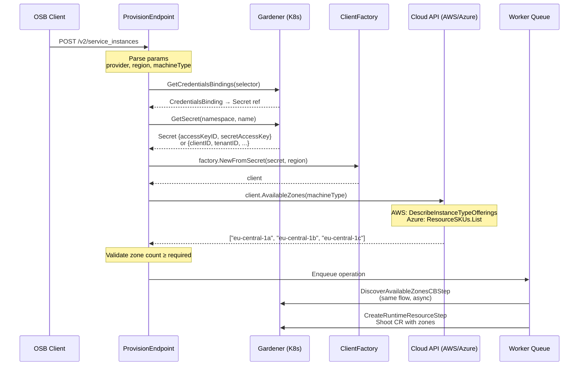
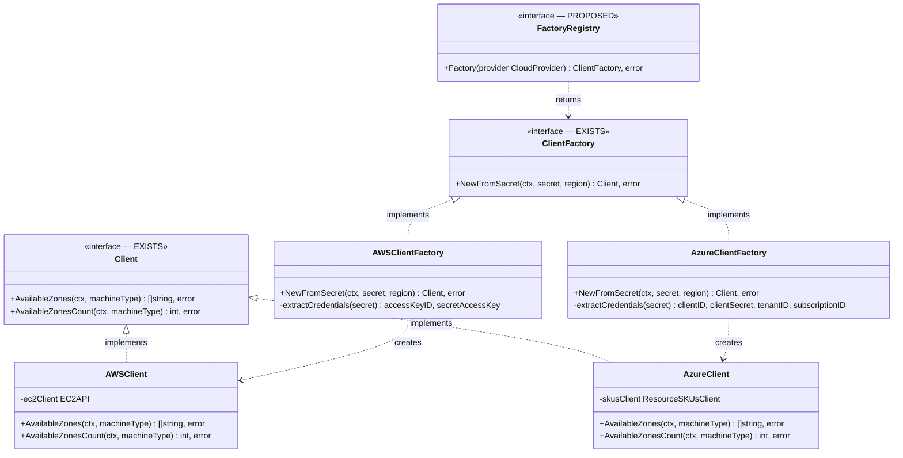
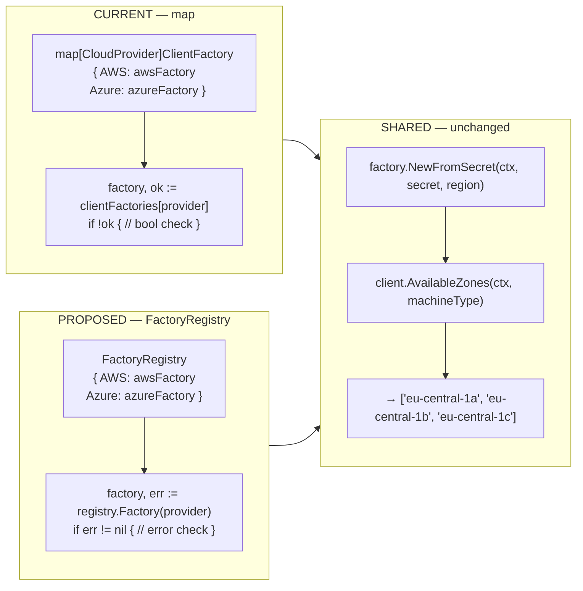
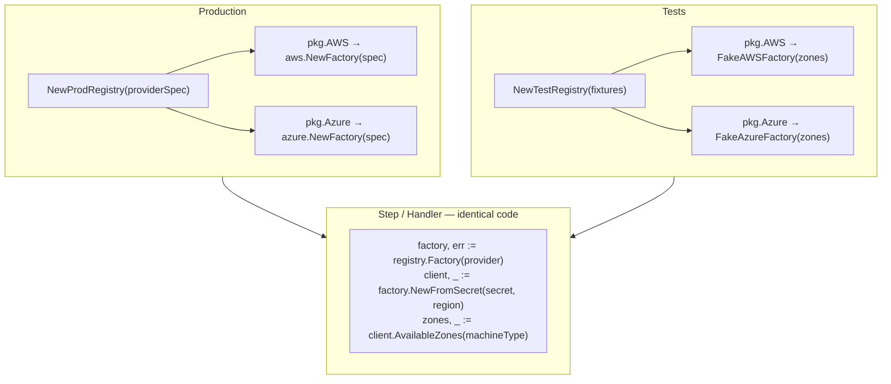

<!--{"metadata":{"publish":false}}-->
# Zone Discovery — Architecture Diagrams

## 1. Full provisioning flow

---

## 2. Interface hierarchy — current vs proposed

---

## 3. Current map vs FactoryRegistry

---

## 4. Prod vs Test wiring (proposed)

